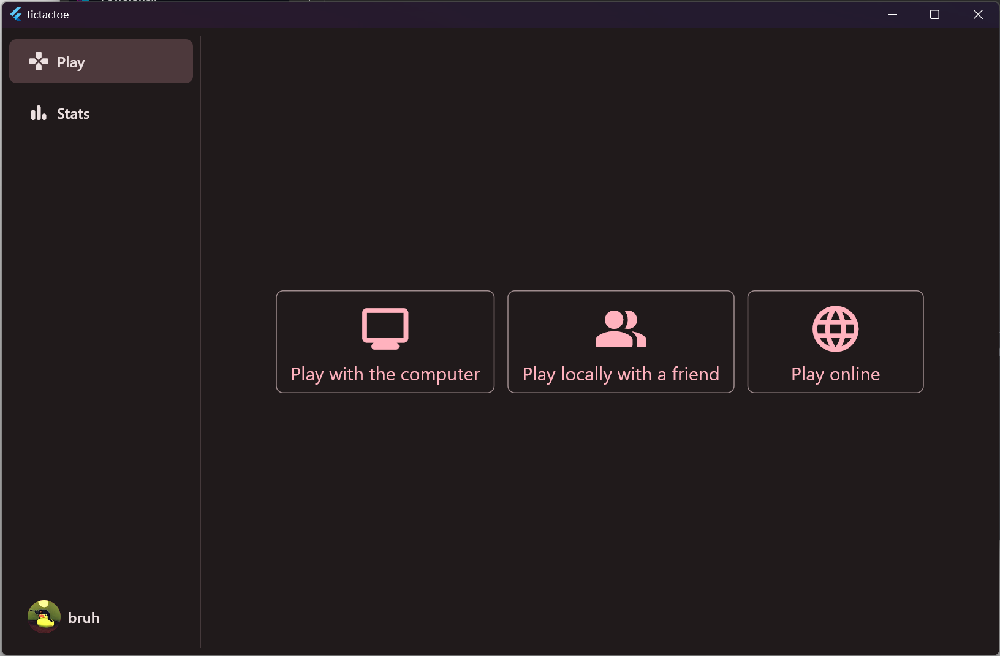

# tictactoe
Tic-tac-toe app made with Flutter and express.js

This application consists of a frontend made using [Flutter](https://flutter.dev) and a backend server made using [express.js](https://expressjs.com/)

## Running
Instructions on how to run both the frontend and the server are given in their respective directories.

- [Running the frontend](app/README.md)
- [Running the server](server/README.md)

The frontend has been tested on Windows, Android and the web.
The backend has been tested on Windows only.

## Some screenshots

